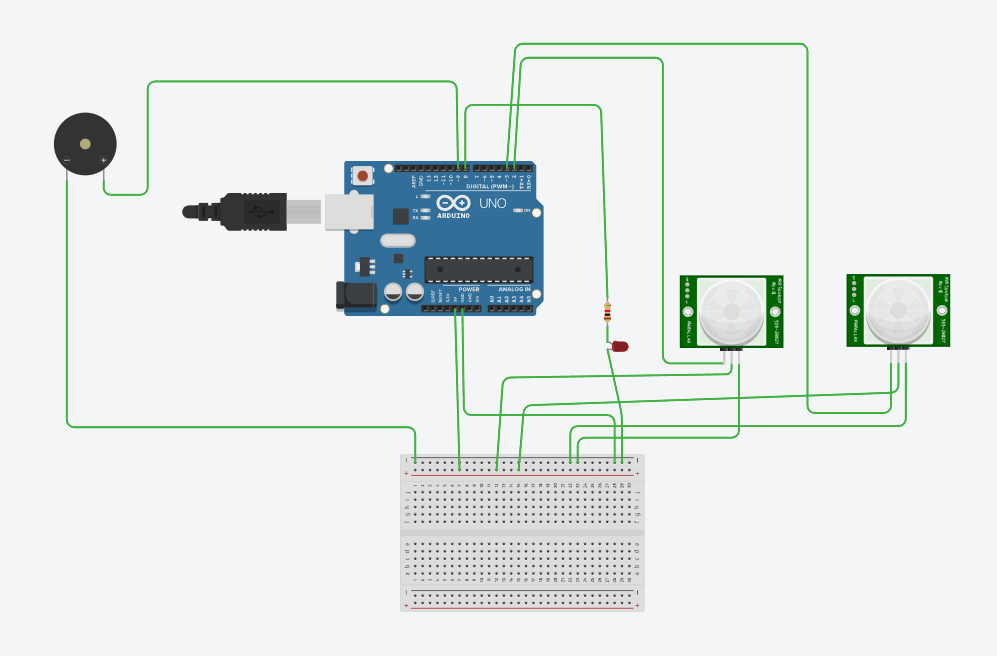
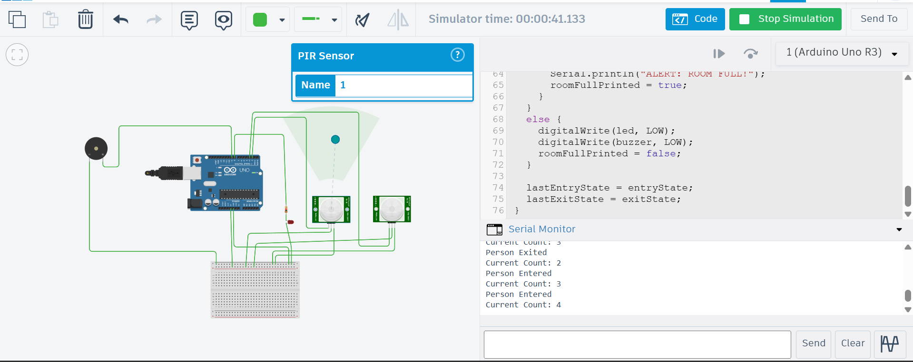
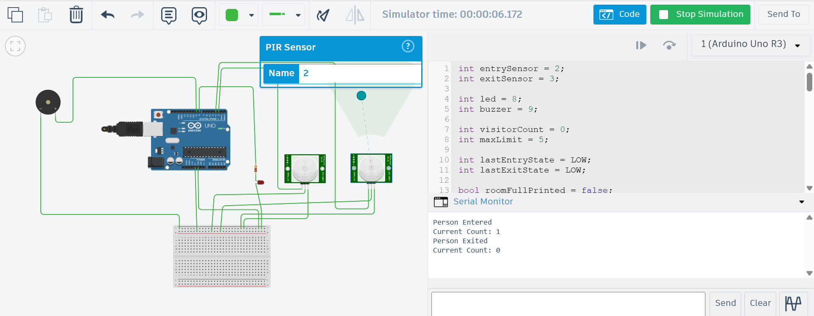
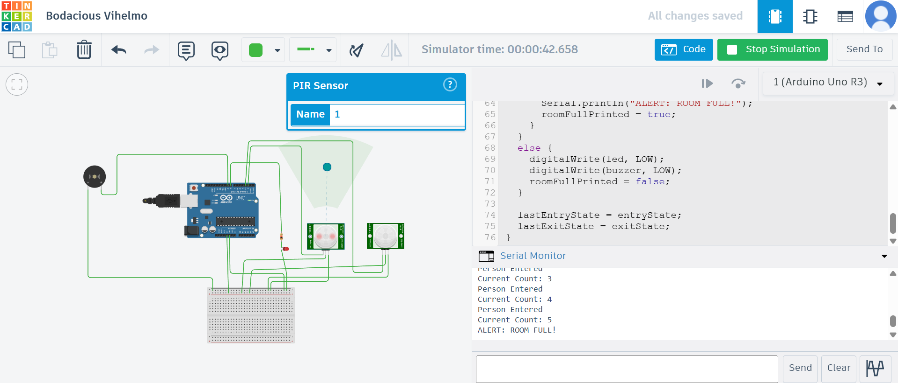
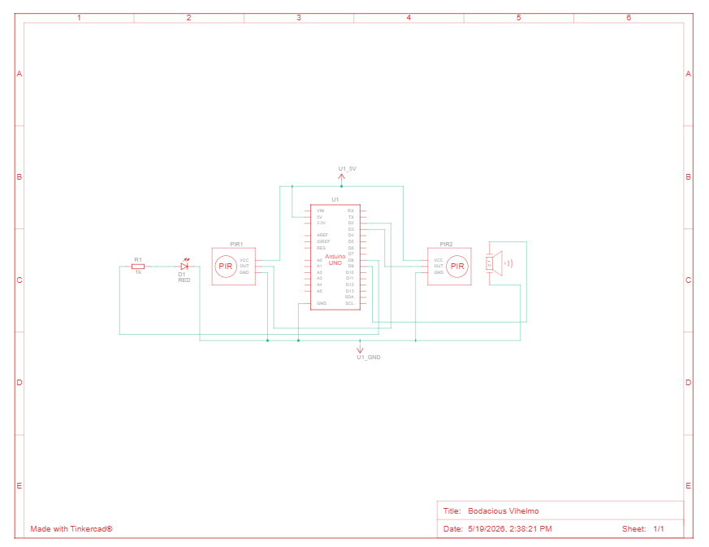

# Smart Visitor Counter using Arduino UNO

## Overview
This project is an embedded system that counts the number of people entering and exiting a room using PIR sensors. The system uses Arduino UNO to process sensor inputs and displays the live visitor count through the Serial Monitor. An LED and buzzer alert are activated when the room reaches its maximum occupancy limit.

## Features
- Real-time visitor counting
- Entry and exit detection using PIR sensors
- Serial Monitor output for live tracking
- LED and buzzer alert for room-full condition
- Built and tested using Tinkercad simulation

## Components Used
- Arduino UNO
- 2 PIR Sensors
- LED
- 220Ω Resistor
- Buzzer
- Breadboard
- Jumper Wires

## Working
- PIR Sensor 1 detects entry and increases the visitor count.
- PIR Sensor 2 detects exit and decreases the visitor count.
- When the count reaches the threshold value, the LED and buzzer turn ON.
- The current count is displayed on the Serial Monitor.

## Technologies Used
- Arduino UNO
- Embedded C/C++
- PIR Sensor Interfacing
- Serial Communication
- Tinkercad Simulation

## Output
The system successfully tracks room occupancy and alerts when the room reaches its maximum visitor limit.

## Screenshots

### Circuit Diagram

### Entry Detection

### Exit Detection

### Room Full Alert

### Schematic view

